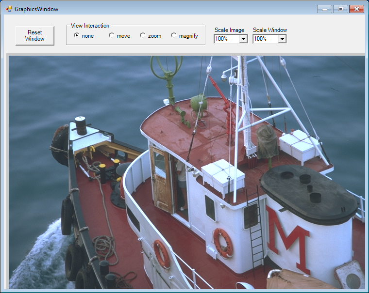
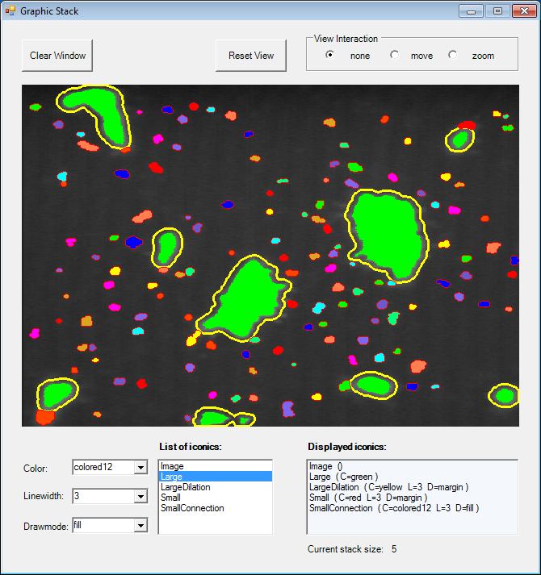
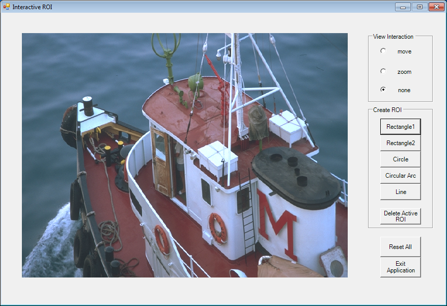
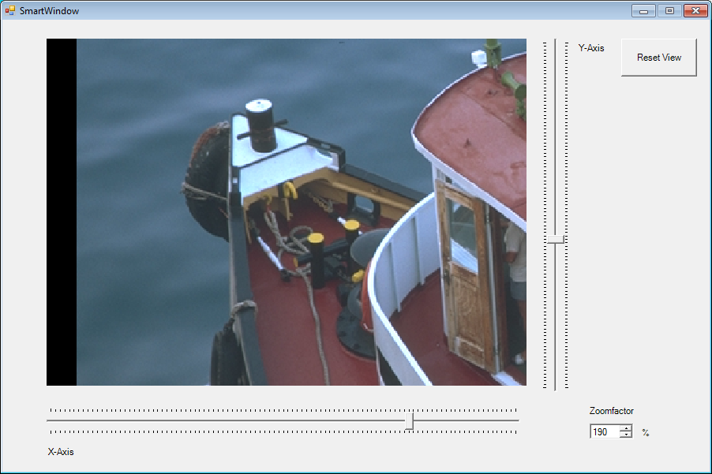
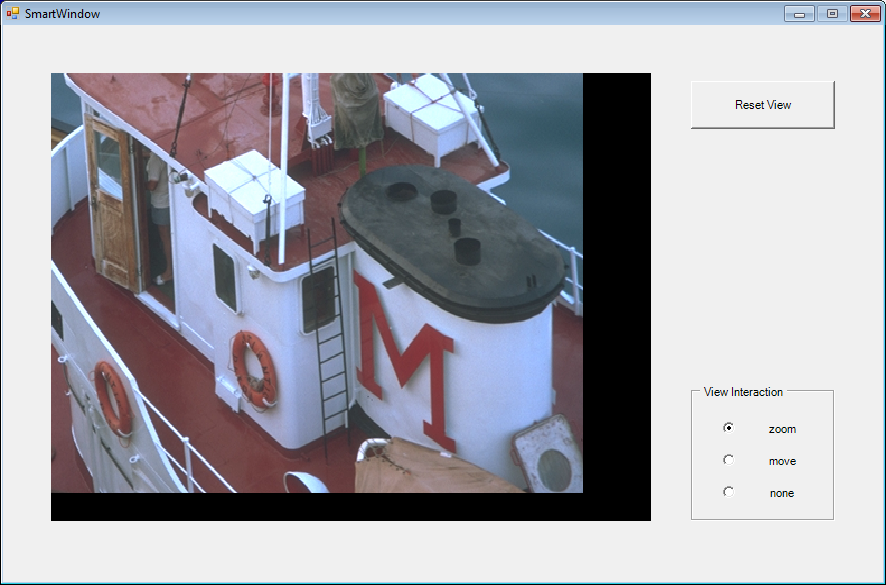
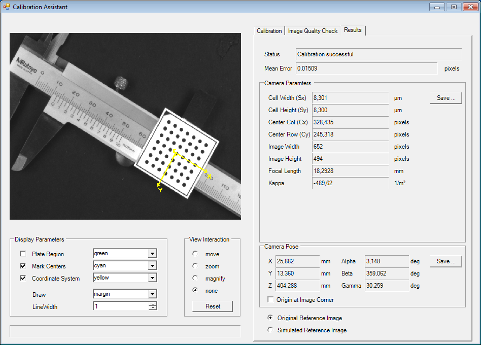
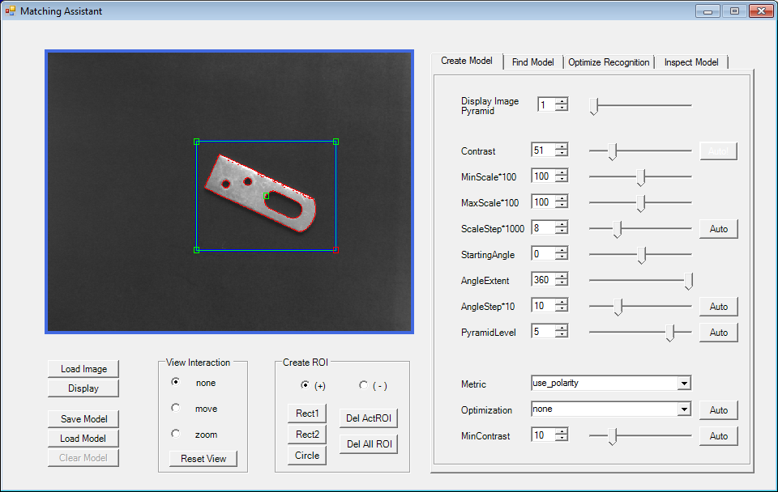
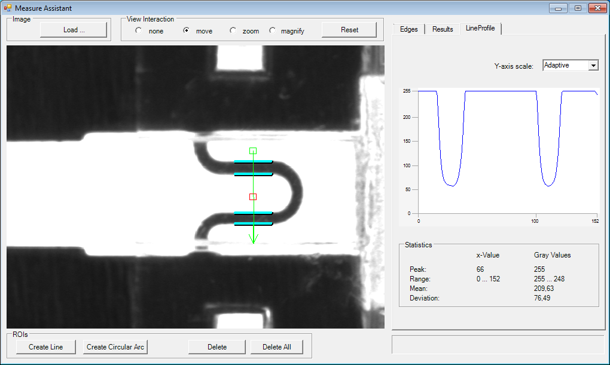

## Overview

The HALCON Codelets section provides various class libraries and applications that demonstrate specific functionalities and how to use them within HALCON. These are primarily divided into the following categories:

### Visualization Class Libraries

- **ViewROI**
  - Provides basic visualization functionality similar to HDevelop, including interactive control of the graphics window and ROI (Region of Interest) handling.
  - Usage is demonstrated in application examples listed below.

- **Calibration**
  - Implements the functionality of HDevelop's Calibration Assistant 
  - Examples demonstrating how to use these classes are provided.

- **Matching**
  - Provides functionality for matching operations as implemented in HDevelop's Matching Assistant 
  - Examples are provided to demonstrate usage.

- **Measure**
  - Implements the Measure Assistant functionalities as described in HDevelop's Measure Assistant 
  - Example applications demonstrate how to use these classes.

### Application Examples

- **GraphicsWindow**
  - Utilizes visualization classes to re-implement HDevelop's graphics window, including interactive zooming and scaling of images and windows.
  - 

- **GraphicsStack**
  - Re-implements HDevelop's graphics stack to visualize iconic objects layered on top of each other.
  - 

- **InteractiveROI**
  - Re-implements HDevelop's interactive ROI creation.
  - 

- **SmartWindow1**
  - Uses visualization classes for a graphics window with interactive image zooming and moving, controlled via sliders.
  - 

- **SmartWindow2**
  - Similar to SmartWindow1 but controlled via mouse interactions.
  - 

- **Calibration**
  - Uses the visualization classes and the classes for the calibration assistant to implement an interactive calibration environment.
  - 

- **Matching**
  - Uses the visualization classes and the classes for the matching assistant to implement an interactive matching environment.
  - 

- **Measure**
  - Uses the visualization classes and the classes for the measure assistant to implement an interactive measurement environment.
  - 
